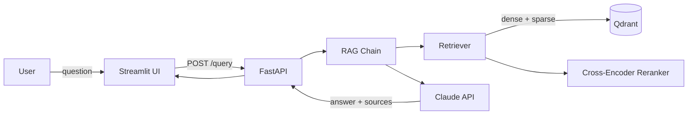

# Company Policy RAG

A production-grade Retrieval-Augmented Generation system that lets employees ask questions about company policy documents and get accurate, sourced answers.

Upload your company handbook, HR policies, or any internal documents — the system chunks them, embeds them into a vector database, and answers questions grounded in your actual documents.

## Architecture



## Features

- **Document Ingestion** — Upload PDFs or text files, automatically chunked and embedded
- **Hybrid Search** — Combines dense vector search with BM25 keyword search via Reciprocal Rank Fusion
- **Cross-Encoder Reranking** — Two-stage retrieval for higher precision
- **Multi-Provider LLM** — Supports Anthropic Claude and OpenAI GPT
- **RAGAS Evaluation** — Quantitative quality metrics (faithfulness, relevancy, precision, recall)
- **REST API** — FastAPI with automatic OpenAPI documentation
- **Chat UI** — Streamlit interface with document upload and source citations
- **Docker** — Full containerization with docker-compose
- **CI/CD** — GitHub Actions for linting and testing

## Evaluation Results

| Metric | Score |
|---|---|
| Faithfulness | 1.00 |
| Answer Relevancy | 0.84 |
| Context Precision | 1.00 |
| Context Recall | 1.00 |

Evaluated using [RAGAS](https://docs.ragas.io/) on 10 hand-crafted Q&A pairs against a sample company handbook.

## Tech Stack

| Component | Technology |
|---|---|
| Embeddings | sentence-transformers (all-MiniLM-L6-v2) |
| Vector Database | Qdrant |
| LLM | Anthropic Claude (claude-sonnet-4-6) |
| Orchestration | LangChain |
| API | FastAPI |
| UI | Streamlit |
| Evaluation | RAGAS |
| Sparse Search | BM25 (rank-bm25) |
| Reranking | Cross-Encoder (ms-marco-MiniLM-L-6-v2) |
| CI/CD | GitHub Actions |
| Containerization | Docker |

## Quick Start

### Prerequisites

- Python 3.12
- An Anthropic API key

### Setup

```bash
# Clone the repo
git clone https://github.com/medysaly/company-policy-rag.git
cd company-policy-rag

# Create virtual environment
python3.12 -m venv .venv
source .venv/bin/activate

# Install dependencies
pip install -e ".[dev]"

# Set up environment variables
cp .env.example .env
# Edit .env and add your ANTHROPIC_API_KEY
```

### Run

```bash
# Terminal 1: Start the API
make serve

# Terminal 2: Start the UI
make ui
```

Open http://localhost:8501 in your browser.

### Docker

```bash
docker compose up --build
```

## API Documentation

Start the server with `make serve`, then visit http://localhost:8000/docs for the interactive Swagger UI.

| Endpoint | Method | Description |
|---|---|---|
| `/health` | GET | Health check |
| `/ingest` | POST | Upload and process a document |
| `/query` | POST | Ask a question |

## Project Structure

```
company-policy-rag/
├── app/
│   ├── api/            # FastAPI routes and schemas
│   ├── embeddings/     # Embedding model wrapper
│   ├── evaluation/     # RAGAS evaluation pipeline
│   ├── generation/     # LLM and RAG chain
│   ├── ingestion/      # Document loading and chunking
│   ├── retrieval/      # Hybrid search and reranking
│   ├── vectorstore/    # Qdrant vector store
│   └── config.py       # Pydantic settings
├── ui/                 # Streamlit chat interface
├── tests/              # Pytest test suite
├── scripts/            # CLI utilities
├── data/               # Sample documents and eval dataset
├── docs/               # Architecture decisions
├── Dockerfile
├── docker-compose.yml
└── pyproject.toml
```

## Design Decisions

See [docs/DECISIONS.md](docs/DECISIONS.md) for detailed Architecture Decision Records covering:

- Why Qdrant over ChromaDB/Pinecone
- Why local embeddings over OpenAI
- Why hybrid search with RRF
- Why cross-encoder reranking

## What I Learned

Building this project taught me:

- How RAG systems work end-to-end, from document ingestion to answer generation
- The importance of evaluation — metrics beat vibes
- That hybrid search significantly improves retrieval for keyword-heavy queries
- How to design provider-agnostic abstractions for LLM calls
- Docker containerization for multi-service applications
- Building REST APIs with FastAPI and interactive UIs with Streamlit
